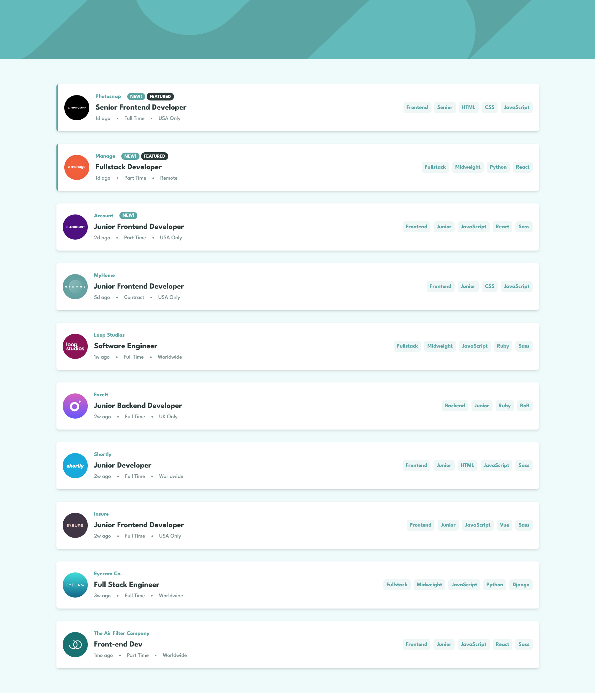
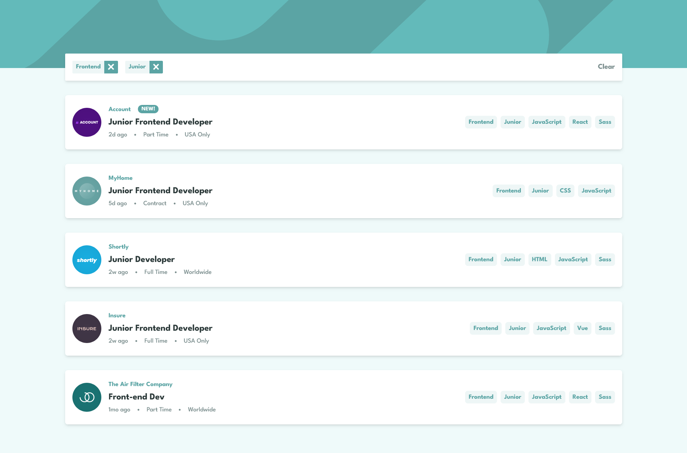
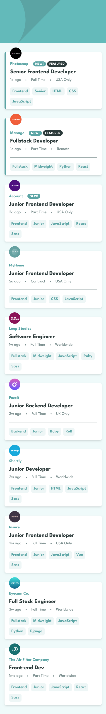
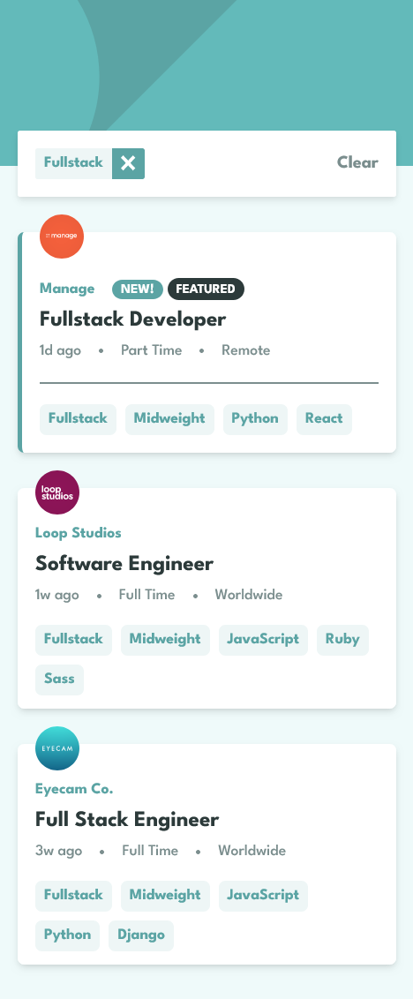

# Frontend Mentor - Job listings with filtering solution

This is a solution to the [Job listings with filtering challenge on Frontend Mentor](https://www.frontendmentor.io/challenges/job-listings-with-filtering-ivstIPCt). Frontend Mentor challenges help you improve your coding skills by building realistic projects.

## Table of contents

- [Overview](#overview)
  - [The challenge](#the-challenge)
  - [Screenshot](#screenshot)
  - [Links](#links)
- [My process](#my-process)
  - [Built with](#built-with)
  - [What I learned](#what-i-learned)
  - [Continued development](#continued-development)
  - [Useful resources](#useful-resources)
- [Author](#author)
- [Acknowledgments](#acknowledgments)

## Overview

### The challenge

Users should be able to:

- View the optimal layout for the site depending on their device's screen size
- See hover states for all interactive elements on the page
- Filter job listings based on the categories

### Screenshot

### Links

- Solution URL: [Solution URL](https://www.frontendmentor.io/solutions/job-filtering-page-using-react-tailwindcss-redux-toolkit-BeafsW9HSo)
- Live Site URL: [Live Site URL](https://frontendmentor-job.vercel.app/)

## My process

### Built with

- Flexbox
- Mobile-first workflow
- [React](https://reactjs.org/) - JS library
- [TailwindCSS](https://tailwindui.com/) - CSS Framework
- [Redux Toolkit](https://redux-toolkit.js.org/) - State Management
- [Framer Motion](https://www.framer.com/motion/) - Animations

## Author

- Frontend Mentor - [@f1x3d49](https://www.frontendmentor.io/profile/f1x3d49)
